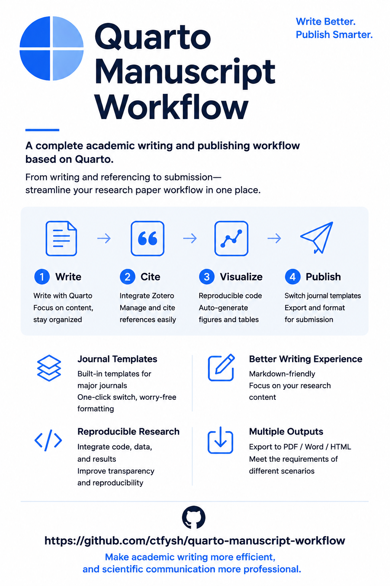
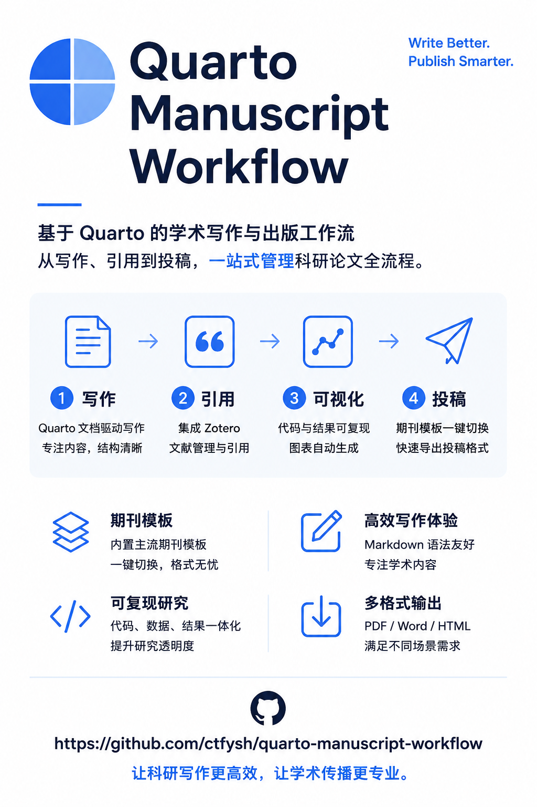

# Quarto Manuscript Workflow

[**English**](#english) | [**中文**](#中文)

An AI-agent skill for academic manuscript production. Hand the agent your materials (notes, Word draft, figures, or just an idea) and get back a journal-formatted `.docx`. No `.qmd` syntax to write, no Quarto commands to run. **Slash command: `/quarto-manuscript-workflow`**

---

## English

### How to use

Activate the skill in three ways:

| Way | Example | How it works |
|-----|---------|-------------|
| **Slash command** | `/quarto-manuscript-workflow I want to submit this draft to ES&T` | Symlinked in `~/.config/opencode/skills/` → loads skill automatically |
| **Natural language** | "Help me format this paper for Nature" | The orchestrator detects manuscript intent and loads the skill automatically |
| **Explicit skill call** | "Load the manuscript skill" | Triggers `skill(name="quarto-manuscript-workflow")` directly |

Once activated, tell the agent your materials and target journal. Everything else is automated.

### Examples by scenario

| Scenario | What you have | Example |
|----------|--------------|---------|
| A | Just an idea, nothing written | [`examples/scenario-A-ideas-only-en.md`](examples/scenario-A-ideas-only-en.md) |
| B | Scattered notes, slides, emails | [`examples/scenario-B-fragments-en.md`](examples/scenario-B-fragments-en.md) |
| C | A complete Word/Markdown draft | [`examples/scenario-C-word-draft-en.md`](examples/scenario-C-word-draft-en.md) |
| D | Final manuscript, need formatting | [`examples/scenario-D-complete-manuscript-en.md`](examples/scenario-D-complete-manuscript-en.md) |
| E | Existing Quarto project, need QA | [`examples/scenario-E-existing-project-en.md`](examples/scenario-E-existing-project-en.md) |

### What makes this different

| Problem | This skill |
|---------|-----------|
| You have fragments (meeting notes, PPT slides, chat messages, half a draft) | Agent classifies each fragment, assembles into IMRaD, marks uncertain segments |
| You only have an idea and a target journal | Agent does a 2-question interview (title + journal), scaffolds the full project with TODO blocks for what's missing |
| You have a complete Word/Markdown draft | Agent parses styles, extracts figures and citations, builds `.qmd`, applies journal template |
| You'll iterate on structure | Agent reorders sections, swaps figures, adds citations, re-renders on each request |
| You don't know what's missing | Coverage report: ✅ Intro ✅ Methods ❌ Results; all gaps shown at once, not one-at-a-time |

The agent never blocks on missing material. It inserts `<!-- TODO: ... -->` blocks and keeps going. The project is always renderable.

### Input → Output

| You give the agent… | The agent… |
|---------------------|------------|
| A target journal (just say the name) | Looks up the CSL, copies the matching reference doc, generates `_quarto.yml` |
| Word `.docx` / Markdown / notes / slides | Parses content into `.qmd` sections, extracts figures to `figures/`, generates bib entries from DOIs |
| Just a topic ("microplastics review for Nature") | Structured interview (2 questions) → scaffolds full project with TODO blocks |
| "Swap to ES&T" | Swaps CSL and configuration for the new journal, re-renders |
| "Methods after Results" | Reorders sections, re-renders |

Output is always a rendered `.docx` with:
- Journal-specific citation formatting (CSL)
- Consistent typography (reference doc)
- Figures placed by Quarto
- Abstract processed through a Lua filter from YAML into body text
- **Optional Supporting Information**: standalone `si.qmd` with S-prefix numbering via Quarto profiles

### Adaptive workflow

The agent picks the flow based on what you hand it, not a fixed pipeline:

- **Ideas only** → 2 questions (title? journal?) → scaffold + TODOs → template → render
- **Fragments** → classify → assemble → coverage report → template → render
- **Full draft** → parse → extract → template → render
- **Existing Quarto project** → verify config → check cross-refs → re-render
- **Revision request** → edit → pre-flight check → render → deliver

### Pre-flight check (agent runs this before render)

- `.gitignore` set up for `_manuscript/` and `_freeze/`
- `freeze` matches phase (`false` while editing, `true` for final)
- `lang` matches journal language (all current journals → `en`)
- `cite-method` matches the journal
- CSL and reference doc are from the same journal
- Manuscript body language matches `lang`; auto-fixes mismatches, marks uncertain segments with `<!-- LANG-CHECK -->` comments
- **If SI exists**: `_quarto-si.yml` project type is `default` (not `manuscript`), equation post-processing applied

---

## 中文

### 使用方法

三种方式激活 skill：

| 方式 | 示例 | 原理 |
|------|------|------|
| **斜杠命令** | `/quarto-manuscript-workflow 帮我把这篇稿子投 ES&T` | symlink 到 `~/.config/opencode/skills/` → 自动加载 skill |
| **自然语言** | "帮我整理稿件投 Nature" | 编排器检测到稿件意图，自动加载 skill |
| **显式调用** | "加载 manuscript skill" | 直接触发 `skill(name="quarto-manuscript-workflow")` |

激活后告诉 Agent 你的素材和目标期刊即可，剩下全自动。

### 场景示例

| 场景 | 你的素材 | 示例 |
|------|----------|------|
| A | 只有想法 | [`examples/scenario-A-ideas-only-zh.md`](examples/scenario-A-ideas-only-zh.md) |
| B | 零散的笔记、PPT、邮件 | [`examples/scenario-B-fragments-zh.md`](examples/scenario-B-fragments-zh.md) |
| C | 完整的 Word/Markdown 稿 | [`examples/scenario-C-word-draft-zh.md`](examples/scenario-C-word-draft-zh.md) |
| D | 写好的稿子，只要排版 | [`examples/scenario-D-complete-manuscript-zh.md`](examples/scenario-D-complete-manuscript-zh.md) |
| E | 已有 Quarto 项目，需要检查 | [`examples/scenario-E-existing-project-zh.md`](examples/scenario-E-existing-project-zh.md) |

### 这套 skill 解决了什么问题

| 问题 | 这套 skill 的做法 |
|------|-------------------|
| 你有碎片材料（会议笔记、PPT 幻灯片、聊天记录、半成品草稿） | Agent 将每段碎片分类，按 IMRaD 顺序组装，对不确定的段落做标记 |
| 你只有一个想法和一本目标期刊 | Agent 问 2 个问题（标题 + 期刊），搭建完整项目骨架，空缺处插入 `<!-- TODO -->` |
| 你有一份完整的 Word/Markdown 稿 | Agent 解析段落样式、提取图表和引用，构建 `.qmd`，套用期刊模板 |
| 你需要反复调整结构 | Agent 调整章节顺序、替换图表、补充引用，每次按需重新渲染 |
| 你不知道缺什么 | 覆盖率报告：✅ 引言 ✅ 方法 ❌ 结果；所有缺口一次性展示，非逐个询问 |

Agent 从不因缺内容而阻塞。缺的材料插入 `<!-- TODO: ... -->` 标记后继续推进。项目始终可渲染。

### 输入 → 输出

| 你给 Agent… | Agent… |
|-------------|--------|
| 目标期刊名称 | 查找 CSL，复制对应的 reference-doc，生成 `_quarto.yml` |
| Word `.docx` / Markdown / 笔记 / 幻灯片 | 解析内容到 `.qmd` 各章节，提取图片到 `figures/`，通过 DOI 生成 bib 条目 |
| 只有一个选题（如"微塑料综述，投 Nature"） | 结构化访谈（2 个问题）→ 搭建完整项目骨架 + TODO |
| "改投 ES&T" | 换 CSL 和配置，重新渲染 |
| "把方法部分移到结果后面" | 重新排布章节，重新渲染 |

输出始终是一个已排版的 `.docx`：
- 期刊专属引用格式（CSL）
- 统一版式（reference-doc）
- 图片由 Quarto 自动排版
- 摘要通过 Lua 过滤器从 YAML 移至正文
- **可选 Supporting Information**：独立 `si.qmd`，S 前缀编号，通过 Quarto profile 渲染

### 自适应工作流

Agent 不跑固定流水线——根据你给的材料类型自动选择策略：

- **只有想法** → 问 2 个问题（标题？期刊？）→ 骨架 + TODO → 套模板 → 渲染
- **碎片材料** → 分类 → 拼装 → 缺口报告 → 套模板 → 渲染
- **完整稿子** → 解析 → 提图提引用 → 套模板 → 渲染
- **已有 Quarto 项目** → 配置验证 → 交叉引用检查 → 重新渲染
- **修改请求** → 编辑 → 起飞前检查 → 渲染 → 交付

### 起飞前检查（Agent 每次渲染前自动执行）

- `.gitignore` 是否已包含 `_manuscript/` 和 `_freeze/`
- `freeze` 是否与当前阶段匹配（编辑中 = `false`，定稿 = `true`）
- `lang` 是否与期刊语言一致（当前全部期刊 → `en`）
- `cite-method` 是否与所选期刊一致
- CSL 和 reference-doc 是否来自同一期刊
- 正文语言是否与 `lang` 匹配——自动修复不匹配段落，不确定的标记 `<!-- LANG-CHECK -->`
- **如含 SI**：`_quarto-si.yml` 中 `project.type` 必须为 `default`，方程编号已后处理
